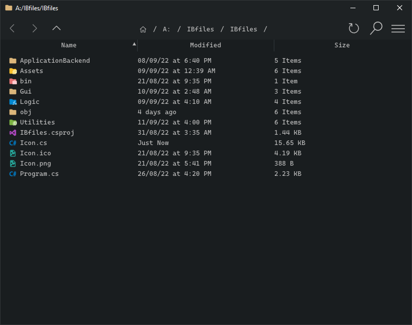

# File manager

Simple cross platform Gui file manager/browser
inspired by windows explorer and linux's dolphin

## Screenshots

## Planned Features
- Similar to windows file manager
- Simalar to dolphin linux file manager
- Customize enviroment variables (i need to do this often)
- Customizable right click menu

### Icons used
https://github.com/PKief/vscode-material-icon-theme

### Icon Font used
https://github.com/microsoft/vscode-codicons
